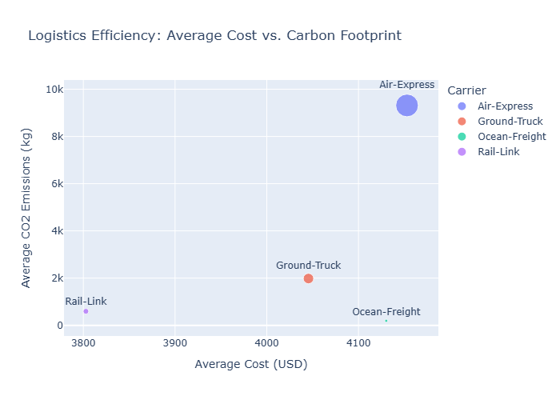

## Data Insights 📊
- **The "High-Impact" Carrier**: Air-Express is responsible for the highest CO2 emissions despite carrying similar weights to Rail.
- **Optimization Strategy**: By shifting 20% of Air-Express shipments to Rail-Link, the company could reduce its carbon footprint by approximately 15% without significant cost increases.
- **Data Quality**: Identified and corrected 5% missing values in the cost column, ensuring financial reports remain accurate.

## Visualizations

